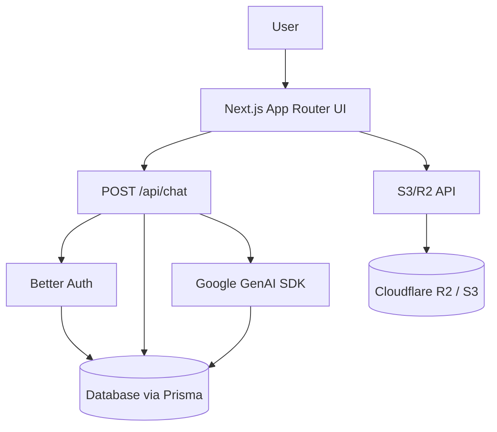

#  Task Fusion AI

[](https://bun.sh)
[](https://nextjs.org)
[](https://tailwindcss.com)
[](https://prisma.io)

Task Fusion AI is a powerful, AI-driven task management platform that enables users to plan, prioritize, and execute workflows through natural language interactions and real-time tool-assisted automation.


## Features

- **Gemini-Powered Intelligence**: Advanced task orchestration using the latest Google Gemini models.
- **Natural Language Task Management**: Create, update, search, or delete tasks simply by chatting.
- **Multi-Turn Tool Execution**: Sophisticated AI logic that can chain multiple actions together in a single request.
- **Modern Chat UI**: Premium interface featuring real-time streaming, collapsible reasoning, and copy-to-clipboard functionality.
- **Media Storage**: Seamless profile image management via direct-to-bucket uploads (S3/Cloudflare R2).
- **Secure Authentication**: Robust session management and social account linking via Better Auth.
- **Real-time Persistence**: Automatic synchronization between AI interactions and your task database.

## Tech Stack

- **Framework**: Next.js 16 (App Router)
- **Language**: TypeScript & React 19
- **Runtime**: Bun
- **AI Engine**: Google GenAI SDK (Gemini 2.5 Flash Lite)
- **Database**: Prisma ORM + PostgreSQL / SQLite
- **Storage**: Cloudflare R2 / S3 Compatible Storage
- **Auth**: Better Auth
- **Styling**: Tailwind CSS & Framer Motion

## Architecture


```mermaid
graph TD
    User[User]
    UI[Next.js App Router UI]
    ChatAPI[POST /api/chat]
    S3API[S3/R2 API]
    GenAI[Google GenAI SDK]
    Storage[(Cloudflare R2 / S3)]
    DB[(Database via Prisma)]
    Auth[Better Auth]

    User --> UI
    UI --> ChatAPI
    UI --> S3API
    S3API --> Storage
    ChatAPI --> Auth
    ChatAPI --> DB
    ChatAPI --> GenAI
    GenAI --> DB
    Auth --> DB
```

## Setup

1. **Clone the repository**:

   ```bash
   git clone https://github.com/lwshakib/task-fusion-ai-powered.git
   cd task-fusion-ai-powered
   ```

2. **Install dependencies**:

   ```bash
   bun install
   ```

3. **Configure Environment**:

   ```bash
   cp .env.example .env
   ```

   Fill in your `.env` with your Database URL, Google API Key, Better Auth secrets, and Storage credentials.

4. **Initialize Database**:

   ```bash
   bun run db:migrate
   ```

5. **Setup Storage Bucket**:

   ```bash
   bun run bucket:setup
   ```

6. **Start Development Server**:
   ```bash
   bun run dev
   ```

## Contributing

We welcome contributions! Please read [CONTRIBUTING.md](CONTRIBUTING.md) before opening a pull request.

## License

This project is licensed under the MIT License. See [LICENSE](LICENSE).
