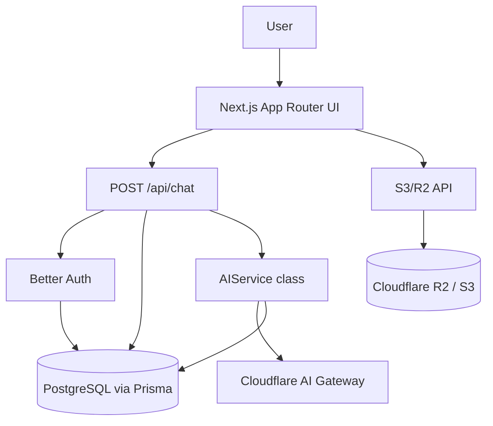

#  Task Fusion AI

[](https://bun.sh)
[](https://nextjs.org)
[](https://tailwindcss.com)
[](https://prisma.io)

Task Fusion AI is an AI-powered task management platform that helps users plan, prioritize, and execute work through real-time chat and tool-assisted automation.


## Features

- **AI Task Management**: Creation, updating, deletion, and search via streaming tool calls.
- **Media Storage**: Direct-to-bucket profile image uploads via Cloudflare R2 / S3 compatibility.
- **Advanced Auth**: Better Auth integration with session management and social account linking.
- **AI Gateway**: Cloudflare AI Gateway integration for optimized and cached model requests.
- **Responsive Settings**: Modern account management grid with session revocation and live updates.
- **Real-time Streaming**: Instant assistant responses using streaming text and tool execution.

## Tech Stack

- **Framework**: Next.js 16 (App Router)
- **Language**: TypeScript & React 19
- **Runtime**: Bun
- **Database**: Prisma ORM + PostgreSQL (Neon)
- **Storage**: Cloudflare R2 (S3 Compatible)
- **Auth**: Better Auth
- **AI**: Cloudflare AI Gateway (Gemini/Llama)

## Architecture


```mermaid
graph TD
    User[User]
    UI[Next.js App Router UI]
    ChatAPI[POST /api/chat]
    S3API[S3/R2 API]
    AIService[AIService class]
    Gateway[Cloudflare AI Gateway]
    Storage[(Cloudflare R2 / S3)]
    DB[(PostgreSQL via Prisma)]
    Auth[Better Auth]

    User --> UI
    UI --> ChatAPI
    UI --> S3API
    S3API --> Storage
    ChatAPI --> Auth
    ChatAPI --> DB
    ChatAPI --> AIService
    AIService --> Gateway
    AIService --> DB
    Auth --> DB
```

## Setup

1. **Clone the repository**:

   ```bash
   git clone https://github.com/lwshakib/task-fusion-ai-powered.git
   cd task-fusion-ai-powered
   ```

2. **Install dependencies**:

   ```bash
   bun install
   ```

3. **Configure Environment**:

   ```bash
   cp .env.example .env
   ```

   Fill in your `.env` with Database, Auth, AI, and Storage keys.

4. **Initialize Database**:

   ```bash
   bun run db:migrate
   ```

5. **Setup Storage Bucket**:

   ```bash
   bun run bucket:setup
   ```

6. **Lunch Development Server**:
   ```bash
   bun run dev
   ```

## Contributing

Please read [CONTRIBUTING.md](CONTRIBUTING.md) before opening a pull request.

## License

This project is licensed under the MIT License. See [LICENSE](LICENSE).
